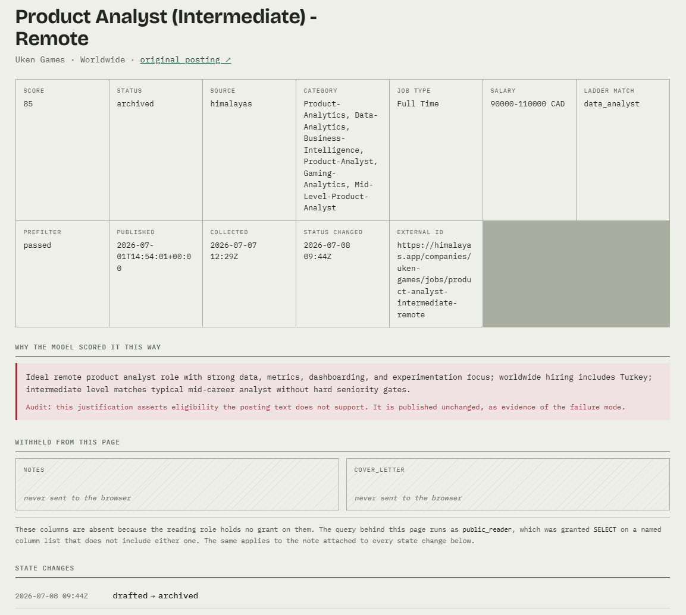

# Job-Search Orchestrator

A personal pipeline that collects remote job postings, scores them with an
LLM, drafts grounded cover letters, and records applications behind a
human-confirmation gate — backed by PostgreSQL with a role-based
public/private boundary and served through a FastAPI read layer. One user,
real data, real audit trail.

**Dashboard:** `static/index.html`, a single static page served same-origin
by the API — no build step; run it locally with `uvicorn src.api.main:app`
(see *Running it*). An earlier read-only Streamlit mirror of a SQLite
snapshot is at https://jobsearchorchestrator.streamlit.app.

The interesting part is not that an LLM scores jobs. It is what this repo
does about the fact that neither LLM outputs nor the operator's own memory
can be taken at their word:

- **`probes/truncation.py`** — an A/B probe proving that a context cap
  which silently filters text changes the model's verdict, and that the
  model's written justification is post-hoc narrative, not a mechanism
  trace.
- **`probes/reason_audit.py`** — before scoring justifications were
  published, every strong textual claim in them was verified against the
  stored posting text: 32/34 grounded. The two failures (unsupported
  eligibility claims on jobs 412 and 616) are published deliberately, as
  evidence of the failure mode, and the dashboard flags them.
- **`job_events`** — an append-only audit trail. Append-only is enforced
  by *database permission*, not convention: the application role holds
  INSERT on `job_events` and nothing else, so even the app cannot rewrite
  history.
- **Committed repair scripts** (`seeds/repair_*.py`) — when history needed
  correcting, it was done by precondition-gated, dry-run-first scripts
  committed to the repo, never by untracked hand-edits. The most recent
  (`repair_20260728.py`) undoes an accidental `applied` transition; the
  gap it leaves in the event-id sequence is kept on purpose — the gap *is*
  the audit record.

## Pipeline

collect → prefilter → score → draft → apply

- **Collect** (`src/collect.py`): four adapters (Remotive, Himalayas,
  RemoteOK, Greenhouse ATS) behind one registry; dedup on
  `UNIQUE(source, external_id)`; existing rows are never silently
  rewritten.
- **Prefilter** (`src/core/prefilter.py`): deterministic, LLM-free triage
  — allowlist location eligibility and title relevance — so paid scoring
  only sees plausible matches.
- **Score** (`src/core/scoring.py`): Claude Haiku rates 0–100 with a
  one-sentence reason; hard seniority gates cap scores into a stretch
  band instead of hiding the role.
- **Draft** (`src/core/drafting.py`): two-link prompt chain on Claude
  Sonnet — structured match analysis first, cover letter written from the
  analysis, grounding rules forbidding invented experience. The letter,
  status change, timestamp and audit event commit in a single
  transaction.
- **Apply** (`src/apply.py`): deliberately excluded from the automated
  run. A CLI gate surfaces eligibility facts, scans for red-flag phrases,
  and requires typed human confirmation; the state machine records the
  transition atomically with its event.

## API and security boundary

`src/api/` is a FastAPI layer over the same store, split into a public
surface and an operator surface — and the split is enforced by PostgreSQL,
not by application code:

- **Public routes** (`/api/jobs`, `/api/jobs/{id}`,
  `/api/jobs/{id}/events`) run under a `NOLOGIN` role `public_reader`
  whose SELECT grants are *column-scoped*. Private columns (notes, cover
  letters) are not filtered out of responses — the role cannot read them
  at all. Each request issues `SET LOCAL ROLE public_reader` inside its
  transaction, with a fail-closed guard that 500s any public route not
  actually running as that role.
- **Operator routes** (`/api/operator/...`) require a bearer token
  (constant-time compare, fail-closed at boot if unset) and can read the
  withheld columns and trigger the apply flow — per job, with explicit
  confirmation, and a separate acknowledgement step if red flags were
  detected. No bulk variant exists by design.
- **`probes/grant_parity.py`** checks that the grants in the database
  match the public column allowlist — and it was proven to bite: inject a
  leaked column and it exits 1.

The dashboard (`static/index.html`) renders the public surface and makes
the boundary visible: the withheld fields appear as labelled, genuinely
empty slots. The data is not hidden by CSS — it never left the database.

## Deploy gates

Three standalone probes act as the deploy gate, each demonstrated to fail
loudly before being trusted:

1. `src/core/invariants_pg.py` — event-trail invariants (every non-new
   job has history; timestamps agree with events).
2. `probes/grant_parity.py` — the security boundary above.
3. `probes/apply_gate.py` — the apply route's auth and state-machine
   behaviour, verified from a separate connection after exit so a missing
   commit cannot hide.

Run them against a configured environment (the third needs a throwaway
database, `SCRATCH_DATABASE_URL` — see `.env.example`; it never touches
the live store):

    python -m src.core.invariants_pg
    python -m probes.grant_parity
    python -m probes.apply_gate

"Demonstrated to fail" means exactly that: remove the apply route's
`conn.commit()` and `apply_gate` reports zero persisted rows; drop
`require_operator` from the writer dependency and its 401 checks turn red.

## Tests

`tests/` holds unit tests that need no database: the state-machine graph,
the red-flag scanner, prefilter rules, score parsing, HTML cleaning, bearer
auth, and a static check that `db/roles.sql` grants exactly the public
allowlist. They run in CI on every push; the three deploy gates above need
a Postgres and run by hand.

    pip install -r requirements-dev.txt
    pytest -q

## Known open questions

This project publishes its mistakes, so: the top-scored job in the store
(95) re-scored at 72 under later code — whether that's a prompt change or
score non-determinism at `temperature=0` is an open, documented question.
Scores here are treated as samples, not truths.

## Repository layout

    src/adapters/   four job-board adapters behind one registry
    src/core/       prefilter, scoring, drafting, tracking, invariants
    src/api/        FastAPI public + operator surfaces
    db/             schema, roles, callable schema applier
    seeds/          migrator (SQLite → Postgres) and committed repairs
    probes/         deploy gates + published investigations
    tests/          unit tests, no database required
    static/         read-only dashboard, no build step
    dashboard/      Streamlit snapshot mirror

## Running it

Needs Python 3.12 and a local PostgreSQL where your OS user can create a
database (peer auth).

    python -m venv .venv && source .venv/bin/activate
    pip install -r requirements.txt
    cp .env.example .env                 # fill in real values
    cp profile.example.md profile.md     # grounding doc for drafting (gitignored)
    createdb orchestrator
    SCHEMA_DSN=postgresql:///orchestrator python -m db.apply_schema   # as the owning role
    psql orchestrator -f db/roles.sql    # public_reader + orchestrator_app
    psql orchestrator -c "ALTER ROLE orchestrator_app PASSWORD '...'"   # then add it to ~/.pgpass
    set -a; . ./.env; set +a
    uvicorn src.api.main:app             # http://127.0.0.1:8000

The pipeline itself: `python -m src.run` (collect through draft; apply is
CLI-only and always manual).

## Stack

Python · PostgreSQL (psycopg for writes, asyncpg for API reads) · FastAPI
· Anthropic API (Haiku + Sonnet) · Streamlit + Altair
